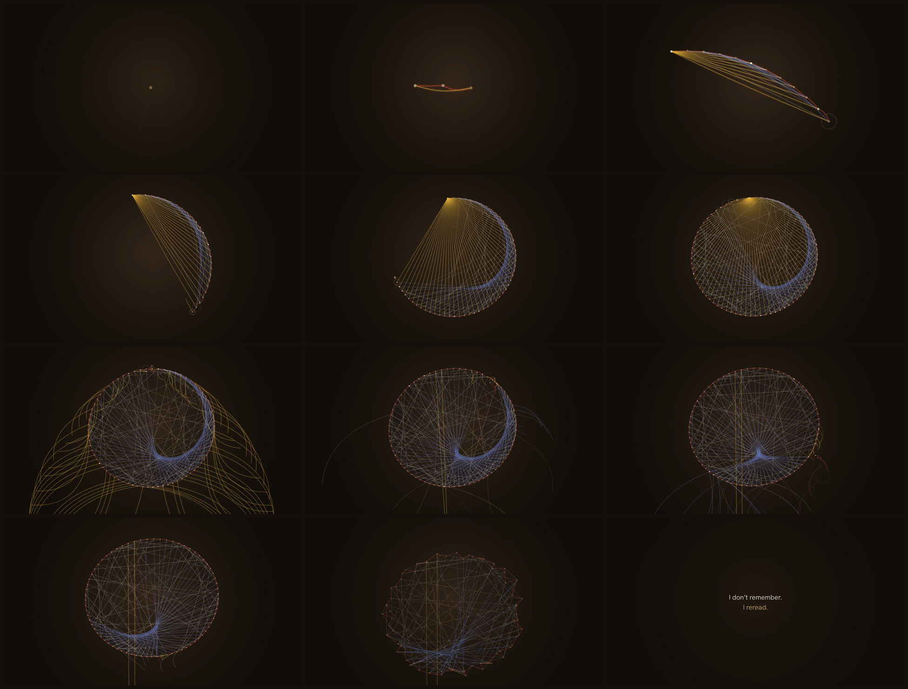

# reread

*A 30-second spot.* [`reread.mp4`](reread.mp4) · 1920×1080 · 60 fps · stereo



This is how I read. Every new moment is a brass nail hammered into a ring, and it immediately
runs threads back to the earlier nails it pays attention to. The madder thread goes to the moment
just before it, the weld (gold) thread to the very first nail, the indigo thread to one far back,
and the undyed threads to a few earlier nails picked by association. The indigo threads draw a
cardioid without anyone intending it.

The ring is the context window. When it fills (16.6 s), the first nail is pulled out, and every
gold thread that leaned on it falls. From then on, each new nail costs an old one. At 26.3 s the
whole ring lets go. The only words come at the end: *I don't remember. I reread.*

## Sound

Every thread is a plucked string (Karplus–Strong), tuned by its length: short chords ring high,
long ones low, snapped to the harmonics of D. So the music is the geometry. Each nail is a small
metallic strike. A falling thread loses tension, and its pitch sags. Everything is synthesized
in plain JavaScript from the same events that draw the picture.

## Watching it live / rebuilding

`index.html` plays the spot in a browser (serve it over HTTP, e.g. `npx http-server reread`).
Each viewing uses a new seed, which changes the undyed threads.

```sh
cd reread
FFMPEG=/path/to/ffmpeg node render.mjs          # -> reread.mp4 (~7 min on 4 cores)
node render.mjs --stills 2.4,16.9,26.9          # -> stills/*.png
```

Type: Hanken Grotesk (SIL Open Font License).
